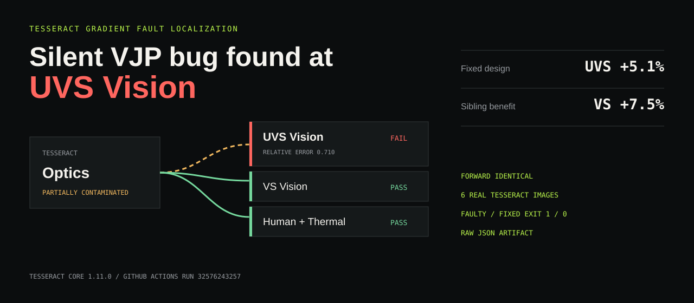

# TessTrace



**TessTrace localizes the faulty VJP boundary in a composed Tesseract DAG, without falsely contaminating healthy sibling branches.**

> Silent VJP bug found at **UVS Vision**. Fixed design: **UVS +5.1%**, **VS +7.5%**, with a better common forward-evaluated loss.

| Evidence | Faulty | Fixed |
|---|---:|---:|
| TessTrace UVS status | `FAIL` | `PASS` |
| VS / Human / Thermal | `PASS` | `PASS` |
| Optics status | `PARTIALLY_CONTAMINATED` | `PASS` |
| Exit code | `1` | `0` |
| UVS visibility | 0.5870 | **0.6169** |
| VS visibility | 0.2725 | **0.2930** |
| Common forward loss | -0.5750 | **-0.5876** |

[Open the live evidence UI](https://lsh2546.github.io/tesstrace-tesseract-hackathon-2026/) · [Verified GitHub Actions run](https://github.com/lsh2546/tesstrace-tesseract-hackathon-2026/actions/runs/32576243257) · [Four-page technical note](docs/tesstrace-technical-note.pdf) · [Apache-2.0 license](LICENSE)

## Reproduce in 60 seconds

```bash
pip install -e .

# Deliberately faulty DAG: UVS FAIL, healthy siblings PASS, exit code 1.
tesstrace --json reports/faulty.json || test $? -eq 1

# Corrected DAG: every node PASS, exit code 0.
tesstrace --fixed --json reports/fixed.json

# Run the complete local contract and evidence-integrity tests.
python -m unittest discover -s tests -v
```

The real-container comparison is the `wingspectrum-comparison` job in the verified Actions run. It builds six Tesseract Core 1.11.0 images, calls `apply` and `vector_jacobian_product`, runs identical 180-step faulty/fixed optimizations, and uploads raw JSON evidence.

## Why TessTrace

A wrong VJP can satisfy every shape check and allow an optimizer to converge. A final loss curve only shows that something went wrong; a per-solver benchmark does not identify how the error propagates through a composed DAG.

**TessTrace does not merely report a gradient mismatch; it localizes the faulty VJP boundary while preserving healthy sibling branches in a composed Tesseract DAG.**

At each tested boundary, TessTrace compares the supplied VJP against a central directional finite difference:

```text
analytic:  <VJP(x, c), d>
reference: <c, (f(x + eps*d) - f(x - eps*d)) / (2*eps)>
```

It then traces failed cotangents upstream. In a fan-out, a shared parent receiving both healthy and failed branch cotangents becomes `PARTIALLY_CONTAMINATED`; healthy siblings remain `PASS`.

```text
                         UVS Vision       FAIL
                       /                   |
design -> Optics -----+---- VS Vision     PASS
          PARTIALLY   +---- Human Vision  PASS
          CONTAMINATED+---- Solar/Thermal PASS
```

### Frozen status semantics

- `PASS`: local gradient contract passed.
- `FAIL`: local node or edge VJP error directly confirmed.
- `CONTAMINATED`: an upstream path received a failed cotangent.
- `PARTIALLY_CONTAMINATED`: healthy and failed branch cotangents meet upstream.
- `UNTESTED`: non-smoothness, instability, or execution failure prevented a verdict.

## WingSpectrum demonstration

WingSpectrum is a reduced-order, differentiable spectral glazing surrogate:

```text
10 coating-band controls -> Optics -> UVS / VS / Human / Solar branches -> robust loss
```

The controlled experiment holds the forward calculation, initial design, Adam optimizer, learning rate `0.16`, 180 iterations, seed `20260822`, and tolerance (`rtol=1e-4`, `atol=1e-7`, `epsilon=1e-6`) fixed. The only difference is that the faulty UVS image reverses the wavelength-axis cotangent in its VJP.

The correction improves model-based UVS visibility by 5.1% and VS visibility by 7.5%. Human-visible reflectance remains below the frozen 0.20 bound in both runs. The artifact preserves settings, complete histories, spectra, directional errors, DAG states, endpoint evidence, image SHAs, and the workflow URL.

## Repository map

```text
src/tesstrace/                 fault localization and status propagation
src/wingspectrum/              frozen reduced-order science model
fixtures/                      minimal contract Tesseracts
wingspectrum_fixtures/         six scientific comparison Tesseracts
scripts/container_validation.py
scripts/wingspectrum_container_comparison.py
ui/                            responsive evidence UI
docs/technical-note.md         submission-oriented technical description
```

## Evidence UI

```bash
python -m http.server 8765 --directory ui
# open http://127.0.0.1:8765/
```

Rebuild the UI evidence only from a downloaded Actions artifact:

```bash
python scripts/build_ui_data.py <artifact-directory> ui/data.js
```

## Scope and limitations

WingSpectrum demonstrates differentiable multi-objective spectral design and gradient-error consequences. It does **not** claim measured bird-collision reduction, a product-ready multilayer coating, fabrication feasibility, or improved solar/thermal performance. UVS and VS values are model-based spectral visibility proxies. TessTrace's directional checks are numerical tests and can return `UNTESTED` around non-smooth or numerically unstable points.

## Verified evidence

- Tesseract Core: `1.11.0`
- Scientific images: Optics, faulty UVS, fixed UVS, VS, Human, Thermal
- Endpoints: real `apply` and `vector_jacobian_product`
- Artifact: `wingspectrum-container-comparison-32576243257`
- Successful run: [32576243257](https://github.com/lsh2546/tesstrace-tesseract-hackathon-2026/actions/runs/32576243257)
- SHA-pinned final audit: [32727604858](https://github.com/lsh2546/tesstrace-tesseract-hackathon-2026/actions/runs/32727604858)
- Public judge UI: [GitHub Pages](https://lsh2546.github.io/tesstrace-tesseract-hackathon-2026/)
